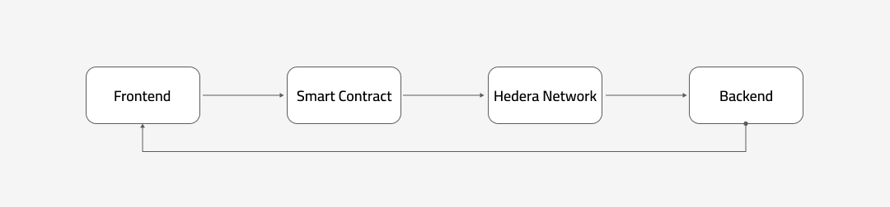

# HashFi – Decentralized On-Chain Reputation Protocol
**Track:** Onchain Finance & Real-World Assets
  
HashFi is a decentralized **on-chain reputation protocol** built on Hedera Hashgraph. It introduces the **Yield Passport**, a smart reputation score that helps users and protocols build trust in DeFi by combining behavioral, financial, and risk-based metrics.

# Hedera Integration Summary
🔵**Hedera Smart Contracts (HSCS)**

We deployed the core logic of HashFi as a **Solidity smart contract** on **Hedera Smart Contract Service (HSCS).**
This enables **transparent**, **immutable**, and **verifiable** reputation scoring directly on-chain.

We chose HSCS because it provides:

• **Predictable low fees** (~$0.001 per transaction) ensuring scalability and sustainability.

• **High throughput** and **finality within seconds**, which is essential for updating user scores in real-time.

• **EVM compatibility**, allowing us to reuse familiar Solidity tools and libraries.

🔵**Transaction Types Executed:**

  • ***ContractCreateTransaction*** :Deploy the main HashFi smart contract.

  • ***ContractExecuteTransaction*** :Update or calculate user reputation scores.

  • ***ContractCallQuery*** :Retrieve and display scores in the frontend dashboard.

 🔵**Hedera Mirror Nodes**
 
The HashFi frontend and backend use **Mirror Node APIs** to fetch **verified on-chain data** for display and analytics.
We chose Mirror Nodes because they offer:

# Economic Justification

Hedera’s **low, predictable transaction fees** and **high throughput** make it ideal for large-scale adoption in Africa and other emerging markets.

Each update or query of a user’s reputation score costs **less than $0.001**, ensuring that the system remains affordable and scalable.

This **cost efficiency**, combined with **ABFT security and finality**, allows HashFi to maintain financial sustainability while delivering reliable on-chain data for millions of potential users.

# Deployment & Setup Instructions

**Installation**

  1.Clone the repository:
    
    git clone https://github.com/HashF1/HashFi.git
    cd HashFi
    
  2.Install dependencies:
  
    npm install

  3.Configure Environment Variables
  
  Create a .env file

    VITE_HEDERA_ACCOUNT_ID=0.0.xxxxxx
    VITE_HEDERA_PRIVATE_KEY=...
    VITE_CONTRACT_ID=0.0.xxxxxx
    
    
  
  4.Run the frontend
  
    npm run dev
    
  localhost:3000

  
# Configuration

Create a **.env** file in the project root:

    VITE_HEDERA_NETWORK=testnet
    VITE_CONTRACT_ADDRESS=0x12...
    VITE_API_KEY=...

# Architecture Diagram

    

# Links & Resources
Web Link:[https://v0-help-with-vercel-rho-red.vercel.app/]

Demo Video:[https://www.youtube.com/watch?v=WW93X8prpvE]

Pitch Deck:[https://drive.google.com/file/d/1wu2iNpRHnJ5Xxrp1KlcTWqJ9E6u-vm6o/view]
